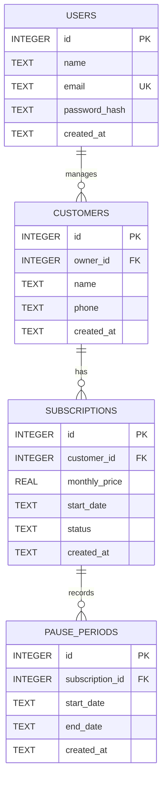

# 🍱 Tif Tof — Tiffin Subscription Management System

A production-grade, full-stack web application designed for home-style lunch and tiffin delivery businesses. It allows owners to manage customers, track monthly subscriptions, pause deliveries for specific date ranges, and compute accurate, pro-rated monthly bills where **customers are billed only for the weekdays on which tiffin was actually served**.

---

## 📌 Problem Statement & Core Business Logic

A typical tiffin service delivers home-cooked meals on **weekdays (Monday to Friday)**. Customers frequently need to pause their subscription when traveling, fasting, or working remotely. 

### Key Business Rule:
> **"A customer must be billed only for the days on which tiffin was actually served."**

Manual calculations using notebooks or spreadsheets often lead to billing errors, disputes, and lost revenue. **TiffinSubs** automates this entirely using an exact mathematical pro-ration algorithm:

$$\text{Daily Rate} = \frac{\text{Monthly Plan Price}}{\text{Total Weekdays in the Selected Month}}$$

$$\text{Days Served} = \text{Total Weekdays in Month} - \text{Paused Weekdays in Month}$$

$$\text{Final Bill} = \text{round}\left(\text{Monthly Plan Price} \times \frac{\text{Days Served}}{\text{Total Weekdays in Month}}, 2\right)$$

*Note: Weekends (Saturday & Sunday) are non-service days and are never counted toward pauses or bill deductions.*

---

## 🛠️ Technology Stack

| Layer | Technology | Key Libraries / Frameworks |
|---|---|---|
| **Frontend** | React 18 (Vite) | Vanilla CSS Design System, Context API, SVG Icons |
| **Backend** | Node.js & Express | `better-sqlite3`, `bcryptjs`, `jsonwebtoken`, `cors`, `dotenv` |
| **Database** | SQLite 3 | Foreign Keys enabled, WAL mode, Indexed queries |
| **Testing** | Node.js Test Suites | Custom test runners for unit & full end-to-end flows |

---

## 🏗️ Architecture & Database Schema



---

## 🚀 Quick Setup & Running Locally

### 1. Prerequisites
- **Node.js** v18.0.0 or higher
- **npm** v9.0.0 or higher

### 2. Backend Setup
```bash
cd backend
npm install
node src/server.js
```
The API server starts on **`http://localhost:5000`**. The SQLite database file will automatically initialize at `data/tiffin.db`.

### 3. Frontend Setup
In a new terminal window:
```bash
cd frontend
npm install
npm run dev
```
The web application runs on **`http://localhost:5173`** (with automatic API proxy to `http://localhost:5000`).

---

## 🧪 Running Tests

### 1. Billing Unit Test Suite (18 edge-case tests)
```bash
cd backend
node src/tests/billing.test.js
```
*Covers zero pauses, single pause, multiple non-contiguous pauses, cross-month pauses, full month pause, weekend inclusion, leap years, and financial rounding.*

### 2. Full End-to-End API Integration Test Suite
```bash
cd backend
node src/tests/e2e.test.js
```
*Validates Register → Login → Dashboard Stats → Add Customer → Search Phone → Pause Service → Overlap Conflict Check → Pro-rated Bill → Resume Service.*

---

## 📖 API Documentation

### Authentication
- `POST /api/auth/register` — Register owner (`name`, `email`, `password`)
- `POST /api/auth/login` — Sign in and obtain JWT token (`email`, `password`)
- `GET /api/auth/me` — Verify current session (Requires `Authorization: Bearer <token>`)

### Customers
- `GET /api/customers?page=1&limit=10&phone=&sortBy=created_at&order=desc` — Paginated, searchable customer list
- `POST /api/customers` — Create customer & initialize active subscription (`name`, `phone`, `monthlyPrice`, `startDate`)
- `GET /api/customers/:id` — Customer profile with complete pause history
- `PUT /api/customers/:id` — Update customer name or phone
- `DELETE /api/customers/:id` — Remove customer and all associated history

### Subscriptions & Operations
- `POST /api/customers/:id/pause` — Pause customer (`startDate`, `endDate`). Validates date ranges and rejects overlapping periods with `409 Conflict`.
- `POST /api/customers/:id/resume` — Restores paused subscription to `ACTIVE`.
- `GET /api/customers/:id/bill?month=YYYY-MM` — Computes pro-rated monthly bill and service breakdown.
- `GET /api/stats/dashboard` — Aggregated counts: Total, Active, Paused, and Estimated Monthly Revenue.

---

## 💡 Key Highlights for Mentor Evaluation
1. **Isolated Billing Engine**: Mathematical logic is decoupled into `billing.service.js` with pure functional design and 100% test coverage.
2. **Overlap Guard**: Backend SQL and service logic strictly prevent duplicate or overlapping pause dates.
3. **Food-Tech Warm UI**: Custom Vanilla CSS design system with responsive tables, quick search, live weekday counter, and printable invoice statements.
