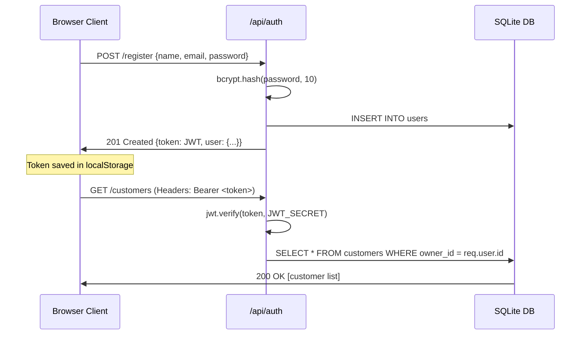

# 🍱 Tif Tof — Tiffin Subscription Management System (`TiffinSubs`)

A production-grade, full-stack web application built for tiffin delivery providers, home chefs, and caterers to manage customer subscriptions, handle daily service pauses, record meal preferences, and generate mathematically accurate, pro-rated monthly bills based strictly on days served.

---

## 📌 Problem Statement

Home-style tiffin delivery services operate on recurring monthly plans. However, customers regularly pause their orders due to out-of-town travel, office holidays, fasting, or personal commitments. In conventional operations using paper ledgers or basic spreadsheets:
- Business owners struggle to calculate manual deductions across multiple disjoint pause intervals.
- Disputes arise when customers are charged for days they did not receive meals.
- There is no unified view of who is active today, who is paused, what meal type each customer ordered (Veg, Non-Veg, Jain), or what their final month-end bill is.

### The Core Solution
**Tif Tof** automates this lifecycle entirely. It implements an isolated, pure mathematical billing engine where:
$$\text{Daily Rate} = \frac{\text{Monthly Plan Price}}{\text{Total Days in Target Month}}$$
$$\text{Days Served} = \text{Total Days in Target Month} - \text{Paused Days in Month}$$
$$\text{Final Payable Bill} = \text{round}\left(\text{Monthly Plan Price} \times \frac{\text{Days Served}}{\text{Total Days in Month}}, 2\right)$$

---

## 👥 Target Users

- **Independent Tiffin Providers**: Home chefs delivering daily meals to students, professionals, and corporate offices.
- **Dabbawalas & Small Meal Caterers**: Local food services requiring quick tracking of daily pauses and transparent customer invoicing.
- **Hostel / Mess Administrators**: Managers tracking monthly mess subscriptions with leave credits.

---

## ✨ Main Features

1. **Owner Authentication**: Secure registration and login with bcrypt password hashing and JWT token issuance.
2. **Customer Management**: Add, view, edit, and delete customer profiles (name, phone number, meal type, start date).
3. **Tiffin Meal Plan Specification**: Categorize customers by meal type:
   - 🥗 Standard Veg Thali
   - 🍗 Special Non-Veg Thali
   - 🌿 Jain Special (No onion/garlic)
   - 🍱 Mini Lunch Box
   - 🥑 High-Protein / Diet Box
   - 🍱 Both Lunch & Dinner Double Dabba
   - ✏️ Custom Meal Descriptions
4. **7-Day Delivery Service Support**: Billing engine supports full 7-day-a-week delivery models.
5. **Flexible Pause Management**:
   - Multi-day pause intervals with automatic calendar month clipping.
   - Database-level overlap protection (`409 Conflict`).
   - Single-click **"🚫 Not Taken Today"** button on the dashboard for instant 1-day pause.
6. **One-Click Resumption**: Instantly reactivates paused subscriptions back to `ACTIVE`.
7. **Pro-Rated Monthly Billing**: Dynamic calculation per month with detailed breakdowns of days served, paused days, per-day rates, and total amount.
8. **Printable Invoices**: Built-in print/PDF stylesheet for physical customer receipts and WhatsApp sharing.
9. **Instant Phone Search**: High-speed, indexed search by phone number.
10. **Server-Side Pagination & Sorting**: Seamlessly browse large customer lists with customizable limits and column sorting.
11. **Dashboard Metrics**: Real-time counters for Total Customers, Active Subscriptions, Paused Subscriptions, and Monthly Revenue.

---

## 🛠️ Technology Stack (Actually Used)

### Backend
- **Runtime**: Node.js
- **Web Framework**: Express.js (`^4.21.0`)
- **Database**: SQLite 3 using `better-sqlite3` (`^11.0.0`) in WAL mode
- **Authentication**: `jsonwebtoken` (`^9.0.2`) & `bcryptjs` (`^2.4.3`)
- **Utilities**: `cors` (`^2.8.5`), `dotenv` (`^16.4.5`)
- **Development**: `nodemon` (`^3.1.4`)

### Frontend
- **Framework**: React 19 (`^19.3.0`)
- **Bundler & Dev Server**: Vite 8 (`^8.3.0`) via `@vitejs/plugin-react` (`^6.1.1`)
- **Styling**: Vanilla CSS Design System with CSS variables and responsive glassmorphic cards
- **State Management**: React Context API (`AuthContext`)

---

## 🏗️ Project Architecture

```
TiffinSubs/
├── backend/
│   ├── .env                    # Environment variables (PORT, JWT_SECRET)
│   ├── package.json            # Backend dependencies & npm scripts
│   ├── data/
│   │   └── tiffin.sqlite       # SQLite database file (auto-generated)
│   └── src/
│       ├── config/
│       │   └── db.js           # Database connection, schemas & migrations
│       ├── controllers/
│       │   ├── auth.controller.js          # Register, Login, Me endpoints
│       │   ├── customer.controller.js      # CRUD, Search, Pagination, Sort
│       │   └── subscription.controller.js  # Pause, Resume, Bill, Stats
│       ├── middleware/
│       │   └── auth.js         # JWT verification middleware
│       ├── routes/
│       │   ├── auth.routes.js      # /api/auth routes
│       │   ├── customer.routes.js  # /api/customers routes
│       │   └── stats.routes.js     # /api/stats routes
│       ├── services/
│       │   └── billing.service.js  # Pure mathematical billing engine
│       ├── tests/
│       │   ├── billing.test.js     # 25-case billing unit test suite
│       │   ├── e2e.test.js         # 10-step full lifecycle integration test
│       │   └── seed_and_test_20.js # 22-customer seeding & scale test
│       └── server.js           # Express application entry point
├── frontend/
│   ├── index.html              # HTML5 entry with Inter font
│   ├── package.json            # Frontend dependencies & npm scripts
│   ├── vite.config.js          # Vite config with API proxy to localhost:5000
│   └── src/
│       ├── main.jsx            # React root mount
│       ├── App.jsx             # Top-level application router & toast alerts
│       ├── index.css           # Custom Vanilla CSS design system
│       ├── context/
│       │   └── AuthContext.jsx # Auth provider & authenticated fetch client
│       └── components/
│           ├── Navbar.jsx              # Responsive header with session state
│           ├── LandingPage.jsx         # Marketing landing page with SRS specs
│           ├── Dashboard.jsx           # Metrics, customer table & actions
│           ├── AuthModal.jsx           # Sign in & registration modal
│           ├── CustomerModal.jsx       # Add & edit customer modal
│           ├── PauseModal.jsx          # Date picker & live impact preview
│           ├── BillModal.jsx           # Pro-rated statement & print slip
│           └── CustomerDetailModal.jsx # Customer profile & pause history
├── README.md                   # Project documentation (this file)
├── REASONING.md                # Development reasoning & decision logs
└── AI_LOGS.md                  # Raw AI conversation log placeholder
```

---

## 🗄️ Database Schema & Entities

The SQLite database (`data/tiffin.sqlite`) operates in Write-Ahead Logging (`WAL`) mode with foreign key enforcement enabled (`PRAGMA foreign_keys = ON`).

### 1. `users` Table
Stores registered business owner accounts.
| Column | Type | Constraints | Description |
|---|---|---|---|
| `id` | INTEGER | PRIMARY KEY AUTOINCREMENT | Unique user ID |
| `name` | TEXT | NOT NULL | Owner full name |
| `email` | TEXT | UNIQUE NOT NULL | Owner email for login |
| `password_hash` | TEXT | NOT NULL | Bcrypt password hash |
| `created_at` | DATETIME | DEFAULT CURRENT_TIMESTAMP | Account creation timestamp |

### 2. `customers` Table
Stores customer contact records scoped to an owner.
| Column | Type | Constraints | Description |
|---|---|---|---|
| `id` | INTEGER | PRIMARY KEY AUTOINCREMENT | Unique customer ID |
| `owner_id` | INTEGER | NOT NULL, FK(`users.id`) ON DELETE CASCADE | Associated business owner |
| `name` | TEXT | NOT NULL | Customer full name |
| `phone` | TEXT | NOT NULL | Customer phone number |
| `created_at` | DATETIME | DEFAULT CURRENT_TIMESTAMP | Timestamp registered |
| `updated_at` | DATETIME | DEFAULT CURRENT_TIMESTAMP | Last updated timestamp |

*Indexes*: `idx_customers_phone` on `phone`, `idx_customers_owner` on `owner_id`.

### 3. `subscriptions` Table
Stores subscription details and current delivery state.
| Column | Type | Constraints | Description |
|---|---|---|---|
| `id` | INTEGER | PRIMARY KEY AUTOINCREMENT | Unique subscription ID |
| `customer_id` | INTEGER | NOT NULL, FK(`customers.id`) ON DELETE CASCADE | Associated customer |
| `monthly_price` | REAL | NOT NULL | Fixed monthly plan rate (₹) |
| `start_date` | TEXT | NOT NULL | Start date (`YYYY-MM-DD`) |
| `status` | TEXT | NOT NULL DEFAULT 'ACTIVE' CHECK(`status` IN ('ACTIVE','PAUSED')) | Delivery status |
| `tiffin_type` | TEXT | DEFAULT 'Standard Veg Thali' | Meal plan description |
| `created_at` | DATETIME | DEFAULT CURRENT_TIMESTAMP | Creation timestamp |
| `updated_at` | DATETIME | DEFAULT CURRENT_TIMESTAMP | Last update timestamp |

*Indexes*: `idx_subscriptions_customer` on `customer_id`.

### 4. `pause_periods` Table
Records historical and upcoming delivery pause date ranges.
| Column | Type | Constraints | Description |
|---|---|---|---|
| `id` | INTEGER | PRIMARY KEY AUTOINCREMENT | Unique pause record ID |
| `subscription_id` | INTEGER | NOT NULL, FK(`subscriptions.id`) ON DELETE CASCADE | Target subscription |
| `start_date` | TEXT | NOT NULL | First paused date (`YYYY-MM-DD`) |
| `end_date` | TEXT | NOT NULL | Last paused date (`YYYY-MM-DD`) |
| `created_at` | DATETIME | DEFAULT CURRENT_TIMESTAMP | Timestamp when pause was logged |

*Indexes*: `idx_pause_sub` on `subscription_id`.

---

## ⚙️ Environment Variables

The backend loads configuration from `backend/.env`.

| Variable | Required | Default | Description |
|---|---|---|---|
| `PORT` | Optional | `5000` | Port for the Express REST API server |
| `JWT_SECRET` | Recommended | `tiffinsubs_secret_key_2026` | Secret string used to sign and verify JWTs |

---

## 🚀 Installation & Setup Guide

### 1. Prerequisites
- **Node.js**: v18.0.0 or higher
- **npm**: v9.0.0 or higher

### 2. Backend Installation & Startup
```bash
# Navigate to backend directory
cd backend

# Install dependencies
npm install

# Start the server (runs on port 5000)
node src/server.js
```
The database will automatically initialize at `backend/data/tiffin.sqlite`.

### 3. Frontend Installation & Startup
In a separate terminal window:
```bash
# Navigate to frontend directory
cd frontend

# Install dependencies
npm install

# Start Vite development server (runs on port 5173)
npm run dev
```
Open **`http://localhost:5173`** in your browser.

---

## 🧪 Testing

### 1. Billing Service Unit Tests (25 Edge Cases)
Tests the isolated billing engine against zero pauses, single pause, multiple pauses, month-boundary clipping, full-month pause, and financial rounding:
```bash
cd backend
node src/tests/billing.test.js
```

### 2. End-to-End API Integration Test (10-Step Lifecycle)
Validates registration, authentication, dashboard metrics, customer creation, phone search, pause intervals, overlap collision (`409 Conflict`), pro-rated billing, and service resumption:
```bash
cd backend
node src/tests/e2e.test.js
```

### 3. 20+ Customer Scale & Seeding Test
Inserts 22 distinct customer accounts, verifies multi-page pagination, tests single-click "Not Taken Today", and asserts live metric totals:
```bash
cd backend
node src/tests/seed_and_test_20.js
```

---

## 📡 REST API Documentation

Base URL: `http://localhost:5000/api`

### Authentication Endpoints

#### 1. Register Owner
- **METHOD**: `POST`
- **ENDPOINT**: `/auth/register`
- **PURPOSE**: Creates a new business owner account and returns an auth token.
- **REQUEST BODY**:
  ```json
  {
    "name": "Chef Sanjeev Kapoor",
    "email": "owner@tiffin.com",
    "password": "password123"
  }
  ```
- **RESPONSE** (`201 Created`):
  ```json
  {
    "message": "User registered successfully.",
    "token": "<JWT_TOKEN_STRING>",
    "user": {
      "id": 1,
      "name": "Chef Sanjeev Kapoor",
      "email": "owner@tiffin.com"
    }
  }
  ```

#### 2. Login Owner
- **METHOD**: `POST`
- **ENDPOINT**: `/auth/login`
- **PURPOSE**: Authenticates existing owner credentials.
- **REQUEST BODY**:
  ```json
  {
    "email": "owner@tiffin.com",
    "password": "password123"
  }
  ```
- **RESPONSE** (`200 OK`):
  ```json
  {
    "message": "Login successful.",
    "token": "<JWT_TOKEN_STRING>",
    "user": {
      "id": 1,
      "name": "Chef Sanjeev Kapoor",
      "email": "owner@tiffin.com"
    }
  }
  ```

#### 3. Get Current Profile
- **METHOD**: `GET`
- **ENDPOINT**: `/auth/me`
- **PURPOSE**: Returns profile for authenticated session.
- **HEADERS**: `Authorization: Bearer <token>`
- **RESPONSE** (`200 OK`):
  ```json
  {
    "user": {
      "id": 1,
      "name": "Chef Sanjeev Kapoor",
      "email": "owner@tiffin.com"
    }
  }
  ```

---

### Customer Management Endpoints

#### 4. List Customers
- **METHOD**: `GET`
- **ENDPOINT**: `/customers`
- **PURPOSE**: Returns paginated, searchable, and sortable list of customers for authenticated owner.
- **HEADERS**: `Authorization: Bearer <token>`
- **PARAMETERS**:
  - `page` *(optional query, integer, default: 1)*
  - `limit` *(optional query, integer, default: 10, max: 50)*
  - `phone` *(optional query, string, searches by substring)*
  - `sortBy` *(optional query, whitelist: `name`, `phone`, `created_at`, `monthly_price`, `status`)*
  - `order` *(optional query, `asc` | `desc`, default: `desc`)*
- **RESPONSE** (`200 OK`):
  ```json
  {
    "customers": [
      {
        "id": 1,
        "name": "Harsh Patel",
        "phone": "9267345623",
        "created_at": "2026-09-17 10:00:00",
        "monthly_price": 2200,
        "start_date": "2026-09-01",
        "status": "ACTIVE",
        "tiffin_type": "Standard Veg Thali",
        "subscription_id": 1
      }
    ],
    "page": 1,
    "limit": 10,
    "total": 1,
    "totalPages": 1
  }
  ```

#### 5. Create Customer
- **METHOD**: `POST`
- **ENDPOINT**: `/customers`
- **PURPOSE**: Adds a customer and initializes their active subscription.
- **HEADERS**: `Authorization: Bearer <token>`
- **REQUEST BODY**:
  ```json
  {
    "name": "Harsh Patel",
    "phone": "9267345623",
    "monthlyPrice": 2200,
    "startDate": "2026-09-01",
    "tiffinType": "Standard Veg Thali"
  }
  ```
- **RESPONSE** (`201 Created`):
  ```json
  {
    "message": "Customer created and subscribed successfully.",
    "customer": {
      "id": 1,
      "name": "Harsh Patel",
      "phone": "9267345623",
      "monthlyPrice": 2200,
      "startDate": "2026-09-01",
      "status": "ACTIVE",
      "tiffinType": "Standard Veg Thali"
    }
  }
  ```

#### 6. Get Customer Details
- **METHOD**: `GET`
- **ENDPOINT**: `/customers/:id`
- **PURPOSE**: Fetches customer contact details, current subscription, and all historical pause periods.
- **HEADERS**: `Authorization: Bearer <token>`
- **RESPONSE** (`200 OK`):
  ```json
  {
    "customer": {
      "id": 1,
      "name": "Harsh Patel",
      "phone": "9267345623",
      "created_at": "2026-09-17 10:00:00",
      "subscription_id": 1,
      "monthly_price": 2200,
      "start_date": "2026-09-01",
      "status": "ACTIVE",
      "tiffin_type": "Standard Veg Thali"
    },
    "pauses": [
      {
        "id": 1,
        "start_date": "2026-09-10",
        "end_date": "2026-09-12",
        "created_at": "2026-09-17 10:05:00"
      }
    ]
  }
  ```

#### 7. Update Customer
- **METHOD**: `PUT`
- **ENDPOINT**: `/customers/:id`
- **PURPOSE**: Modifies customer name, phone number, tiffin type, or monthly price.
- **HEADERS**: `Authorization: Bearer <token>`
- **REQUEST BODY**:
  ```json
  {
    "name": "Harsh Patel",
    "phone": "9267345623",
    "monthlyPrice": 2400,
    "tiffinType": "Special Non-Veg Thali"
  }
  ```
- **RESPONSE** (`200 OK`):
  ```json
  {
    "message": "Customer updated successfully."
  }
  ```

#### 8. Delete Customer
- **METHOD**: `DELETE`
- **ENDPOINT**: `/customers/:id`
- **PURPOSE**: Permanently deletes a customer and cascades deletion to all subscriptions and pause records.
- **HEADERS**: `Authorization: Bearer <token>`
- **RESPONSE** (`200 OK`):
  ```json
  {
    "message": "Customer deleted successfully."
  }
  ```

---

### Subscriptions & Operations Endpoints

#### 9. Pause Subscription
- **METHOD**: `POST`
- **ENDPOINT**: `/customers/:id/pause`
- **PURPOSE**: Pauses a customer's tiffin delivery for a specified date interval.
- **HEADERS**: `Authorization: Bearer <token>`
- **REQUEST BODY**:
  ```json
  {
    "startDate": "2026-09-07",
    "endDate": "2026-09-11"
  }
  ```
- **RESPONSE** (`201 Created`):
  ```json
  {
    "message": "Subscription paused successfully.",
    "startDate": "2026-09-07",
    "endDate": "2026-09-11"
  }
  ```
- **ERROR RESPONSE** (`409 Conflict`):
  ```json
  {
    "message": "This pause period overlaps with an existing pause."
  }
  ```

#### 10. Resume Subscription
- **METHOD**: `POST`
- **ENDPOINT**: `/customers/:id/resume`
- **PURPOSE**: Reactivates a paused subscription back to `ACTIVE`.
- **HEADERS**: `Authorization: Bearer <token>`
- **RESPONSE** (`200 OK`):
  ```json
  {
    "message": "Subscription resumed successfully."
  }
  ```

#### 11. Calculate Monthly Bill
- **METHOD**: `GET`
- **ENDPOINT**: `/customers/:id/bill?month=YYYY-MM`
- **PURPOSE**: Generates an exact pro-rated billing breakdown for the requested month.
- **HEADERS**: `Authorization: Bearer <token>`
- **PARAMETERS**:
  - `month` *(required query, format: `YYYY-MM`, e.g. `2026-09`)*
- **RESPONSE** (`200 OK`):
  ```json
  {
    "month": "2026-09",
    "serviceDaysPerWeek": 7,
    "monthlyPlan": 3000,
    "monthlyPrice": 3000,
    "totalDays": 30,
    "pausedDays": 5,
    "daysServed": 25,
    "perDayRate": 100,
    "finalAmount": 2500,
    "totalAmount": 2500,
    "customerName": "Rahul Verma",
    "customerPhone": "9820123456",
    "tiffinType": "Standard Veg Thali",
    "pauseDetails": [
      {
        "start": "2026-09-07",
        "end": "2026-09-11"
      }
    ]
  }
  ```

#### 12. Create / Renew Subscription
- **METHOD**: `POST`
- **ENDPOINT**: `/customers/:id/subscribe`
- **PURPOSE**: Subscribes a customer who currently has no active subscription.
- **HEADERS**: `Authorization: Bearer <token>`
- **REQUEST BODY**:
  ```json
  {
    "monthlyPrice": 3000,
    "startDate": "2026-09-01"
  }
  ```
- **RESPONSE** (`201 Created`):
  ```json
  {
    "message": "Subscription created successfully.",
    "subscription": {
      "id": 1,
      "monthlyPrice": 3000,
      "startDate": "2026-09-01",
      "status": "ACTIVE"
    }
  }
  ```

#### 13. Dashboard Statistics
- **METHOD**: `GET`
- **ENDPOINT**: `/stats/dashboard`
- **PURPOSE**: Returns aggregated metrics for the logged-in owner.
- **HEADERS**: `Authorization: Bearer <token>`
- **RESPONSE** (`200 OK`):
  ```json
  {
    "totalCustomers": 22,
    "activeCustomers": 21,
    "pausedCustomers": 1,
    "estimatedRevenue": 60400
  }
  ```

#### 14. Server Health Check
- **METHOD**: `GET`
- **ENDPOINT**: `/health`
- **PURPOSE**: Liveness probe.
- **RESPONSE** (`200 OK`):
  ```json
  {
    "status": "ok",
    "timestamp": "2026-09-17T10:15:00.000Z"
  }
  ```

---

## 🔍 Core Mechanism Details

### 1. Authentication Flow


### 2. Search Functionality
- **Endpoint**: `GET /api/customers?phone=<search_term>`
- **Mechanism**: The backend executes a parameterized SQL query:
  ```sql
  WHERE c.owner_id = ? AND c.phone LIKE ?
  ```
  passing `[ownerId, `%${phone}%`]`.
- **Performance**: Guaranteed by index `idx_customers_phone`.

### 3. Pagination Functionality
- **Endpoint**: `GET /api/customers?page=1&limit=10`
- **Mechanism**:
  - `offset = (page - 1) * limit`
  - Runs `LIMIT ? OFFSET ?` on filtered rows.
  - Queries `COUNT(*)` to return total items and total calculated pages: `Math.ceil(total / limit)`.

### 4. Sorting Functionality
- **Endpoint**: `GET /api/customers?sortBy=name&order=asc`
- **Mechanism**: Sanitized through column whitelist:
  ```javascript
  const ALLOWED = ['name', 'phone', 'created_at', 'monthly_price', 'status'];
  ```
  If `sortBy` is `monthly_price` or `status`, sorting is applied on `subscriptions` (`s.monthly_price`, `s.status`), otherwise on `customers` (`c.name`, `c.phone`, `c.created_at`).

---

## 🔧 How to Debug Common Issues

1. **Port 5000 or 5173 In Use**:
   - Error: `EADDRINUSE: address already in use :::5000`
   - Resolution: Terminate existing Node processes or change `PORT=5001` in `backend/.env` and update the target port in `frontend/vite.config.js`.
2. **Database Locked (`SQLITE_BUSY`)**:
   - Cause: Multiple parallel processes writing without WAL mode.
   - Resolution: Ensure `db.pragma('journal_mode = WAL')` remains enabled in `db.js`.
3. **401 Unauthorized / Token Expired**:
   - Cause: Session token expired or invalid secret key.
   - Resolution: Client automatically catches 401, clears `localStorage`, and opens the Login modal.
4. **HTML5 Number Step Error on Pricing**:
   - Symptom: *"The two nearest valid values are 2191 and 2201"*.
   - Resolution: Resolved in `CustomerModal.jsx` using `step="any"` on input fields.

---

## 📋 Status of Requirements & Future Scope

### Implemented Requirements
- [x] Owner Registration & Login with bcrypt & JWT
- [x] Customer CRUD with owner isolation
- [x] Tiffin Service Type / Meal Plan specification
- [x] Subscription lifecycle management (Active / Paused)
- [x] Pause management with overlap protection (`409 Conflict`)
- [x] Single-click "🚫 Not Taken Today" pause action
- [x] 7-Day pro-rated billing calculation
- [x] Phone number search
- [x] Server-side pagination & sorting
- [x] Printable customer bill statements
- [x] Dashboard aggregated metrics
- [x] Unit test suites and end-to-end integration flows

### Future Scope / Not Yet Implemented (As per SRS Section 18)
- [ ] **TODO**: Integrated Online UPI & Payment Gateway (e.g. Razorpay/Stripe direct settlement)
- [ ] **TODO**: Automated WhatsApp delivery reminders & statement messaging via WhatsApp Cloud API
- [ ] **TODO**: Delivery boy mobile route tracking & turn-by-turn map dispatch
